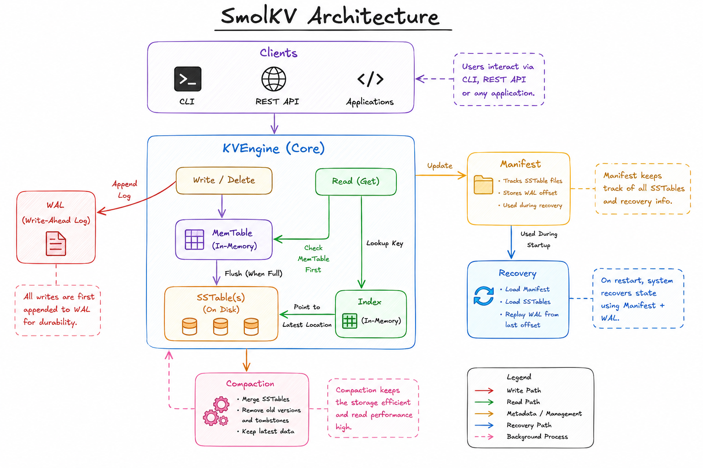
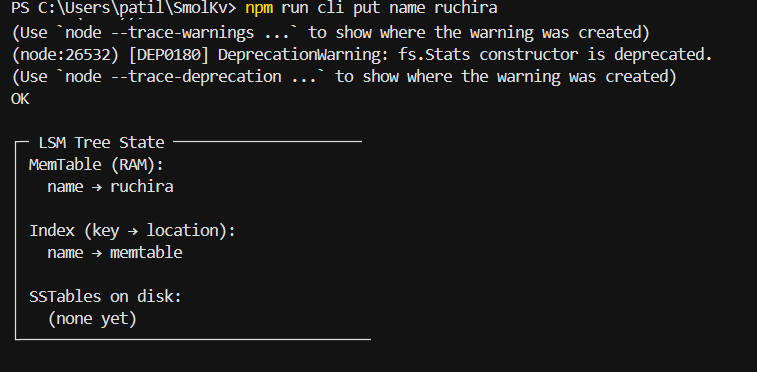

<h1 align="center">SmolKV</h1>

<p align="center">
  <b>A small but functional Log-Structured Merge (LSM) Tree based key-value database built in TypeScript.</b>
 
</p>

---

## About

SmolKV is a lightweight database project that implements the core ideas behind an **LSM Tree storage engine**. The goal of this project is to understand how modern key-value databases manage writes, persistence, recovery, and disk storage by building every component from scratch in TypeScript.

---

SmolKV implements the core pieces of a durable storage engine: a write ahead log for crash recovery, an in memory table for fast writes, immutable on disk SSTables, a manifest to track state across restarts, tombstone based deletes, compaction, and basic transactions plus an HTTP API and CLI on top.

Why this exists
This project is about understanding why databases are built the way they are why writes go to a log before anything else, why deletes can't just erase data, why on-disk files are immutable, and why "merging old files" (compaction) is unavoidable in this design.

## ꕤ  Architecture



## Project Structure

```text
smolkv/
├── src/
│   ├── engine.ts                 # Core database engine
│   ├── index.ts                  # In-memory key → SSTable index
│   ├── transaction.ts            # Buffered transactions (commit/abort)
│   ├── constants.ts              # Shared constants
│   │
│   ├── api/
│   │   └── server.ts             # Express HTTP API
│   │
│   ├── cli/
│   │   └── cli.ts                # Command-line interface
│   │
│   ├── memtable/
│   │   └── memtable.ts           # In-memory write buffer
│   │
│   └── storage/
│       ├── wal.ts                # Write-Ahead Log (WAL)
│       ├── sstable.ts            # Immutable SSTables
│       ├── manifest.ts           # Manifest + WAL checkpoint
│       └── compactor.ts          # SSTable compaction
│
├── tests/                        # Vitest test suite
├── examples/                     # Example scripts
├── data/                         # SSTables + manifest.json (gitignored)
├── database.log                  # WAL file (gitignored)
├── package.json
├── tsconfig.json
└── README.md
```

##ꕤ  Features

### 1. Write-Ahead Log (WAL)

Before any write reaches memory, it is first appended to a Write-Ahead Log (WAL). If the application crashes before the MemTable is flushed, the WAL is replayed during recovery to restore the lost operations.

### 2. MemTable

The MemTable is an in-memory sorted key-value store that serves as the first destination for all writes. Reads always check the MemTable first because it contains the latest data. Once it reaches the configured size limit, it is flushed to disk as an SSTable.

### 3. SSTables

SSTables (Sorted String Tables) are immutable files stored on disk. When the MemTable becomes full, all of its entries are written to a new SSTable. Since SSTables never change after creation, writes remain fast and sequential.

### 4. Manifest

The Manifest keeps track of every SSTable file created by the database along with the last processed WAL offset. During startup it allows the engine to discover existing SSTables and continue recovery safely.

### 5. Index

An in-memory index maps each key to its latest location (either the MemTable or an SSTable). Instead of scanning every SSTable during reads, the engine performs a quick lookup through the index.

### 6. Crash Recovery

After a restart, the engine reloads all SSTables using the Manifest and replays only the WAL entries that were not flushed previously. This guarantees that committed writes are recovered after a crash

### 7. Tombstones

Deleting a key does not immediately remove it from disk. Instead, a special tombstone marker is written. During reads, tombstones hide deleted values, and later compaction permanently removes obsolete data.

### 8. Compaction

Compaction merges multiple SSTables into a single newer SSTable while removing duplicate versions and deleted keys. This reduces disk usage and improves read performance.

### 9. Transactions

SmolKV supports lightweight buffered transactions. Operations are collected inside a transaction and are applied only when commit() is called. Calling abort() discards all pending operations without modifying the database.

Note: Transaction support is currently available through the engine API only.

### 10. REST API

SmolKV exposes an Express-based HTTP API that allows external applications to perform PUT, GET, DELETE and compaction operations without directly interacting with the storage engine.

### 11. CLI

The CLI provides an interactive way to use SmolKV directly from the terminal. Users can insert, retrieve, delete, compact the database and visualize the internal LSM Tree state.
...

## 12. LSM Tree Visualization

SmolKV includes a built-in CLI visualizer that displays the current state of the LSM Tree after each operation. It shows the contents of the MemTable, the in-memory Index, and all SSTables currently stored on disk, making it easier to understand how data flows through the storage engine.

<p align="center">
  
</p>
##ꕤ Getting Started

Install dependencies

npm install
##ꕤ Run the HTTP API

Start the Express server

npm run server

The server starts on:

http://localhost:3000
Example Requests
Insert a Key
curl -X POST http://localhost:3000/put \
-H "Content-Type: application/json" \
-d '{"key":"name","value":"YOUR_NAME"}'
Get a Key
curl http://localhost:3000/get/name
Delete a Key
curl -X DELETE http://localhost:3000/delete/name
Compact SSTables
curl -X POST http://localhost:3000/compact
📡 API Reference
Method Endpoint Request Response
POST /put { "key": "...", "value": "..." } { "status": "ok" }
GET /get/:key — { "value": "..." }
DELETE /delete/:key — { "status": "ok" }
POST /compact — { "status": "compaction completed" }
ꕤ Using the CLI

Start the interactive CLI

npm run cli

Available commands

put <key> <value> Insert or update a key
get <key> Retrieve a value
delete <key> Delete a key
compact Merge SSTables
show Visualize the current LSM Tree
help List all commands
exit Exit the CLI
Example Session

> put name YOUR_NAME
> OK

> put city YOUR_CITY
> OK

> get name
> YOUR_NAME

> delete city
> Deleted

> compact
> Compaction completed.

> show

┌─ LSM Tree State ─────────────────────
│ MemTable (RAM):
│ name → YOUR_NAME
│
│ Index:
│ name → ./data/001.sst
│
│ SSTables:
│ 001.sst
└──────────────────────────────────────

> exit

Note: Each CLI execution automatically calls recover() during startup to restore the latest database state from the WAL and SSTables.

ꕤ Using SmolKV as a Library
import { KVEngine } from "./src/engine.js";

const db = new KVEngine();

// Restore database state after startup
db.recover();

// Write
db.put("name", "YOUR_NAME");

// Read
console.log(db.get("name"));

// Delete
db.delete("name");

console.log(db.get("name")); // undefined
ꕤ Transactions

SmolKV supports lightweight buffered transactions through the Engine API.

const db = new KVEngine();

const tx = db.beginTransaction();

tx.put("a", "1");
tx.put("b", "2");

// Nothing has been written yet.

tx.commit();

// Values are now persisted.

Discard a transaction:

const tx = db.beginTransaction();

tx.put("c", "99");

// Discard pending writes
tx.abort();

Note: Transactions are currently supported only through the Engine API. CLI and HTTP transaction support is planned for a future release.
